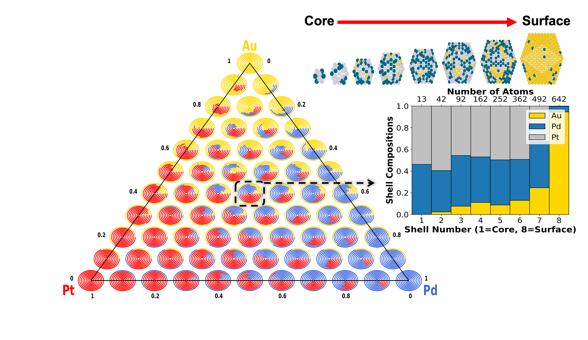

<h1 align="center">CANELa_NP</h1>

Python Package developed for Demystifying the Chemical Ordering of Multimetallic Nanoparticles by Dennis Loevlie, Brenno Ferreira, and Giannis Mpourmpakis*



-------
# Installation 


First you will need to install the original GA repo at https://github.com/mpourmpakis/ce_expansion.  You can install it via pip with:
```
pip install git+https://github.com/mpourmpakis/ce_expansion.git
```
You can then install and work with the code from this repo with the following command:

```
git clone https://github.com/mpourmpakis/CANELa_NP.git
cd CANELA_NP
pip install -e .
```

<h1 align="center">Package Tutorial (demonstration of use)</h1>


## Importing packages

```python
from CANELa_NP.Nanotools import Nanoparticle
import ase.cluster as ac
```

## Creating a bimetallic NP with ASE 


```python
atoms = ac.Icosahedron('Au',5) 
```


```python
print(atoms)
```


    >>> Atoms(symbols='Au309', pbc=False, tags=...)


```python
atoms.symbols[100:] = 'Pd'
```


```python
print(atoms)
```


    >>> Atoms(symbols='Au100Pd209', pbc=False, tags=...)


## Initializing the NP Object


```python
NP = Nanoparticle(atoms)
```

# Visualizing the core to shell element distribution


```python
NP.core_shell_plot()
```


    

    


## Optimizing the chemical ordering


```python
NP.run_ga(max_gens=-1,max_nochange=1_000)
```

    --------------------------------------------------
    GA Sim for Au100Pd209 - none:
     Min: -3.66177 eV/atom -- Gen: 02840
     Form: Au100Pd209
    nAtom: 309
    nGens: 2840
    Start: -3.44202 eV/atom
     Best: -3.66177 eV/atom
     Diff: -0.21974 eV/atom (6.38%)
     Mute: 80.0%
      Pop: 50
     Time: 0:00:28
    --------------------------------------------------
    Saving optimized structure...
    Done!


## Visualizing the core/shell distribution of the optimized chemical ordering


```python
NP.core_shell_plot()
```


    

    


## Visualizing the NP (with ase gui and molgif)

Viewing the full NP

|`NP.view()` | `NP.view(rotate=True)` |
| ------------- | ------------- |
|   |   |


Viewing a slice of the NP (in the x-direction)


|`NP.view(cut=True)` | `NP.view(cut=True,rotate=True)` |
| ------------- | ------------- |
|   |   |


## Working with your own xyz files


```python
xyz_file = 'Example_Data/AuPdPt.xyz'
```


```python
NP = Nanoparticle(xyz_file)
```


```python
NP.core_shell_plot()
```


    

    
<h1 align="center">Generating New Gamma Values</h1>

If you would like to generate gamma values for metal combinations that have not been done yet please follow the following steps from the publication Demystifying the Chemical Ordering of Multimetallic Nanoparticles by Dennis Loevlie, Brenno Ferreira, and Giannis Mpourmpakis*.  

1. Generate equally distributed NP xyz files using the script: [generate_nps](CANELa_NP/Setup_NPs_for_DFT.py)
2. Geometrically optimize these structures to find the most stable energy.  
3. Use this [script](CANELa_NP/Gamma_Value_Calc.py) with the optimized energy values and previously generated structures to calculate the new gamma values (they will be stored in "CANELa_NP/Data/np_gammas.json")
